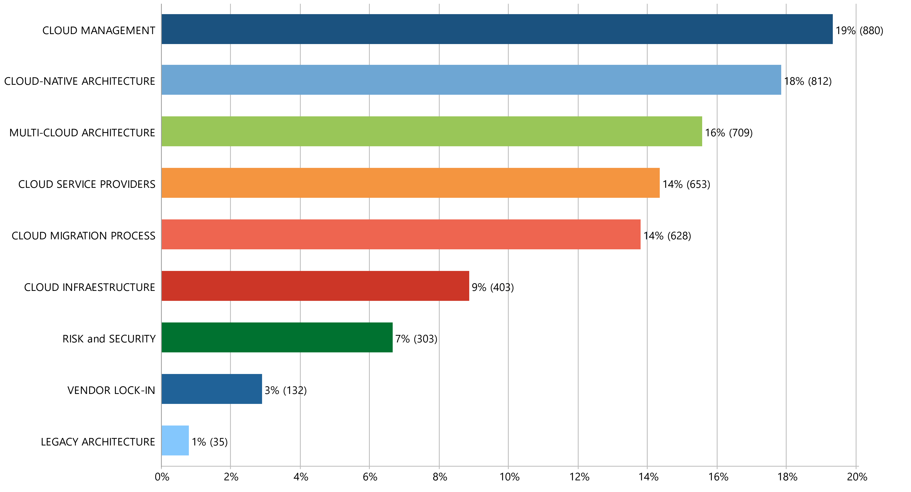

# Multi-Cloud Migration: A Systematic Literature Review

### Benefits and Challenges to Multi-Cloud Migration

|  #  | Code                           | Quotations |     %     | Link  | 
|:---:|:-------------------------------|:----------:|:---------:|:-----:|
| 01  |CLOUD MANAGEMENT                |  880.00    |  19.32%   |   [page](files/01-CLOUD_MANAGEMENT.md)    |
| 02  |CLOUD-NATIVE ARCHITECTURE       |  812.00    |  17.83%   |   [page](files/02-CLOUD-NATIVE_ARCHITECTURE.md)    |
| 03  |MULTI-CLOUD ARCHITECTURE        |  709.00    |  15.57%   |   [page](files/03-MULTI-CLOUD_ARCHITECTURE.md)    |
| 04  |CLOUD SERVICE PROVIDERS         |  653.00    |  14.34%   |   [page](files/04-CLOUD_SERVICE_PROVIDERS.md)    |
| 05  |CLOUD MIGRATION PROCESS         |  628.00    |  13.79%   |   [page](files/05-CLOUD_MIGRATION_PROCESS.md)    |
| 06  |CLOUD INFRAESTRUCTURE           |  403.00    |   8.85%   |   [page](files/06-CLOUD_INFRASTRUCTURE.md)    |
| 07  |RISK and SECURITY               |  303.00    |   6.65%   |   [page](files/07-RISK_and_SECURITY.md)    |
| 08  |VENDOR LOCK-IN                  |  132.00    |   2.90%   |   [page](files/08-VENDOR_LOCK-IN.md)    |
| 09  |LEGACY ARCHITECTURE             |  35.00     |   0.77%   |   [page](files/09-LEGACY_ARCHITECTURE.md)    |

[:arrow_up:](#resultados)

 

.
